# ATP 3.0 v2 — Fresh Schema (DRAFT for Phase 3 [REVIEW])

> **DRAFT — not final.** This is Phase 3 prep produced while Phase 2 is at `[REVIEW]`.
> It is **not approved and no migrations are written yet.** Two gates must clear first:
> (1) `domain-spec.md` approved, and (2) the five **decision forks** in §3 answered —
> each fork changes specific tables, marked ⚡ below. Once both clear, this becomes the
> migration list.
>
> Designed fresh from the approved-pending domain model (no old migrations, no prod
> data). HOW-improvements baked in are logged in `improvements.md`; none change a
> business rule.

---

## 1. Design principles (v2 vs old)

- **Real numeric types, not `float`/`varchar`.** Counter values are `DECIMAL(15,4)`, remaining/residual `DECIMAL(15,4)` nullable — the old schema cast `decimal` to `float` (reintroducing FP error the scale was meant to prevent) and stored `remaining`/`residual` as `varchar`.
- **Referential integrity by FK, not string-match.** Where the old code joined by value-equal strings (work package ↔ work order by `code`, task ↔ AMP item by `reference==code`, everything ↔ aircraft by `registration`), v2 uses real FKs. The business rule (what maps to what) is identical; the mechanism gains integrity and removes the "rename silently writes 0 rows" failure. (A denormalised display string can ride alongside where useful.)
- **Concurrency baked into the schema** (per `domain-spec.md` §0, H1–H12): UNIQUE constraints where `updateOrCreate`/code-gen race (H4, H7, H9, H11); optimistic `lock_version` columns on hot mutable rows (H1, H10) — **gated on fork C5**; deterministic surrogate PKs everywhere.
- **Status as DB-enforced enums**, not free strings — gated on fork M1 for the WP/Task/WO vocabularies.
- **`subject_type` as a real enum** (`functional_location` | `equipment`) instead of ~17 string literals.
- **UTC timestamps**; any aircraft-local interpretation (late-event day boundary) computed from a stored timezone — gated on fork C4.

---

## 2. ERD (Mermaid)

```mermaid
erDiagram
    aircraft_types ||--o{ functional_locations : "type"
    aircraft_types ||--o{ aircraft_type_counters : ""
    counter_refs   ||--o{ aircraft_type_counters : ""
    counter_refs   ||--o{ functional_location_counters : ""
    counter_refs   ||--o{ equipment_counters : ""
    counter_refs   ||--o{ penalty_rules : "monitoring/rate/static"

    functional_locations ||--o{ functional_location_counters : ""
    functional_locations ||--o{ equipment : "installed-base root"
    equipment ||--o{ equipment : "parent_equipment_id (L1>L2>L3)"
    equipment ||--o{ equipment_counters : ""
    items ||--o{ equipment : "part master"
    items ||--o{ functional_locations : ""

    aircraft_types ||--o{ penalty_rules : "scope (NOT NULL)"
    penalties ||--o{ penalty_rules : ""
    penalty_rules ||--o{ penalty_fire_records : "C2 fork"

    functional_locations ||--o{ counter_history : "subject (poly)"
    equipment ||--o{ counter_history : "subject (poly)"
    counter_event_ingestions ||--o{ counter_history : ""
    counter_recalculation_runs }o--|| functional_locations : ""

    maintenance_programs ||--o{ maintenance_program_items : ""
    maintenance_program_items ||--o{ maintenance_program_item_counters : ""
    counter_refs ||--o{ maintenance_program_item_counters : ""
    maintenance_programs }o--o{ functional_locations : "assignment pivot (date_assigned/_unassigned)"
    functional_locations ||--o{ maintenance_program_compliance : ""
    maintenance_program_items ||--o{ maintenance_program_compliance : ""
    counter_refs ||--o{ maintenance_program_compliance : ""

    applicable_configurations ||--o{ applicable_configuration_items : "self-ref tree"
    applicable_configurations ||--o{ configuration_variants : ""
    configuration_variants }o--o{ functional_locations : "pivot"

    publication_types ||--o{ technical_publications : ""
    technical_publications ||--o{ publication_compliances : ""
    functional_locations ||--o{ publication_compliances : ""

    functional_locations ||--o{ flights : ""
    functional_locations ||--o{ daily_flight_logs : ""

    functional_locations ||--o{ work_packages : ""
    work_packages ||--o{ work_package_tasks : ""
    maintenance_program_items ||--o{ work_package_tasks : "FK (was string)"
    counter_refs ||--o{ work_package_tasks : "FK (was string)"
    work_packages ||--o{ work_orders : "FK (was code-string)"
    work_orders ||--o{ time_sheets : ""
    employees ||--o{ time_sheets : ""
    time_sheets ||--o{ time_sheet_entries : ""
    work_packages ||--o{ work_package_activity_log : ""

    functional_locations ||--o{ defects : ""
    defects ||--o{ defect_counters : ""

    utilization_models ||--o{ utilization_model_rates : ""
    measure_units ||--o{ counter_refs : ""
    measure_units ||--o{ utilization_model_rates : ""
```

---

## 3. Decision forks — resolved 2026-06-18

- **✅ C5 — optimistic locking: YES.** Add `lock_version INT UNSIGNED NOT NULL DEFAULT 0` to `functional_location_counters`, `equipment_counters`, `work_packages`, `work_package_tasks`, `work_orders`, `time_sheets`, `defects`. Single authoritative write path still enforced in code. (HOW-improvement.)
- **✅ M4 — completion grain: OVERWRITE + UNIQUE.** `maintenance_program_compliance` keeps one row per `(functional_location_id, maintenance_program_item_id, counter_ref_id)`, updated in place, with a **UNIQUE** constraint on that tuple (closes H9). Faithful to current behavior.
- **✅ F1/F2 — flight capture: ABSOLUTE READINGS.** `flights` carries absolute after-flight readings (like `daily_flight_logs`); corrections reverse-and-replace; one shared idempotency space. **⚠ Approved behavior change** (user sign-off 2026-06-18) — fixes the edit-duration over-count; logged in `improvements.md` #6.
- **✅ M1 — status vocabulary: MRO ENUM IS CANONICAL.** The Fleet WP builder emits MRO status values directly (`work_packages.status` ∈ Planned/In Progress/Completed/Cancelled; `work_package_tasks.status` ∈ OK/Due Soon/Overdue), so a Fleet-built WP passes the first MRO save. Statuses are DB-enforced enums. Closes the cross-L1 drift.
- **⏳ C2 — penalty static-term idempotency: DEFAULT once-per-event (faithful), no new table.** Current behavior (the `prev < threshold` crossing edge + the FOR-UPDATE row lock) is preserved; **no `penalty_fire_records` table** unless you want a hard once-ever-per-crossing guarantee against non-monotonic/concurrent edges (say so and I'll add it). This is the minimal, no-behavior-change default.

---

## 4. Migration list (proposed order)

Foundations → counters → penalties → maintenance/config/pubs → flight → MRO → defects → utilization. Each is one migration; FKs added with their child table.

**Foundations**
1. `users`, `employees`
2. `measure_units` — `code` (unique), `designation`
3. `aircraft_types` — `code` (unique), name
4. `items` — part master: `code` (unique = part number), description
5. `functional_locations` — `registration` (unique), `code` (unique), `aircraft_type_id` FK, `item_id` FK, identity fields. *(Replaces registration-string matching everywhere downstream.)*
6. `equipment` — `functional_location_id` FK (nullable; set only on top-of-tree), `parent_equipment_id` self-FK, `item_id` FK, `hierarchy_level` (L1/L2/L3). Index `(parent_equipment_id)`, `(functional_location_id)`.

**Counters**
7. `counter_refs` — `code` (unique opaque), `counter_code` (unique mnemonic), `measure_unit_id` FK, `incr_decr`, `allow_incr_decr`, `min_value`/`max_value`/`initial_value` **DECIMAL(15,4)**, `parent_counter_id` self-FK, `propagation_from_parent`, `propagation_flag`, `used_for_residual_calc`, `orange_light_limit`.
8. `functional_location_counters` — FK fl + counter_ref, `value_dec DECIMAL(15,4)`, `value_hhmm`, `max_dec`, `remaining DECIMAL(15,4) NULL`, `residual DECIMAL(15,4) NULL`, `propagate`, `is_used`, reading date/hour, `info_source`. **UNIQUE(fl_id, counter_ref_id)**. ⚡C5 `lock_version`.
9. `equipment_counters` — same shape on `equipment_id`. **UNIQUE(equipment_id, counter_ref_id)**. ⚡C5 `lock_version`.
10. `counter_history` — `subject_type` ENUM(`functional_location`,`equipment`) + `subject_id`, counter_ref FK, prev/new dec+hhmm, `delta_dec`, `source_type` ENUM, `source_ref`, `user_id` FK, `note`. Index `(subject_type, subject_id, counter_ref_id, created_at)`.
11. `aircraft_type_counters` — FK type + counter_ref; **UNIQUE(aircraft_type_id, counter_ref_id)**.
12. `counter_event_ingestions` — `idempotency_key` **UNIQUE** (H4), `status` ENUM, `payload` JSON, `event_at_utc`, `event_timezone`, `processed_at`, `processed_by`.
13. `counter_corrections` + `counter_correction_reason_codes` — approval workflow.
14. `counter_recalculation_runs` — `status` ENUM, scope (`counter_ref_ids` JSON, date range), `dry_run`.
15. `counter_compliance_evidences` — immutable evidence rows.

**Penalties**
16. `penalties` — `code` (unique), `is_active`.
17. `penalty_rules` — `penalty_id` FK, `aircraft_type_id` FK **NOT NULL**, `aircraft_id` FK **NULL** (override slot), `monitoring_counter_ref_id`/`rate_counter_ref_id`/`static_counter_ref_id` FKs, `rate_value`/`static_value` DECIMAL, `is_relative`, `threshold_value` NULL, `target_item_id` FK NULL, `is_active`. *(No polymorphic `subject_type`/`subject_id` — dropped as unread.)*
18. ⚡C2 `penalty_fire_records` *(only if once-ever)*.

**Maintenance / Config / Publications**
19. `maintenance_programs`, `maintenance_program_items` (`item_type` ENUM, `apply_one_time`, `link_to_component`), `maintenance_program_item_counters` (FK item+counter_ref, `threshold`/`interval`/`alarm` DECIMAL(12,2), `is_relative`).
20. `maintenance_program_functional_location` pivot — `date_assigned`, `date_unassigned` NULL, approval state.
21. `maintenance_program_compliance` — FK fl+item+counter_ref, `reading_at_completion DECIMAL(15,4)`, `completed_date`, `work_reference`. ⚡M4 unique-or-ledger.
22. `applicable_configurations`, `applicable_configuration_items` (self-ref `parent_id`, `ata_code`, `allowable_part_number`, `expected_quantity`, `requirement_type` ENUM), `configuration_variants`, `configuration_variant_functional_location` pivot.
23. `publication_types` (`code`), `technical_publications` (`reference` unique, `status` ENUM, `applicable_aircraft_type` NULL=fleet-wide, `publication_type_id` FK), `publication_compliances` (FK fl+pub, `compliance_status` ENUM, dates, `utilization_snapshot` JSON). **UNIQUE(fl_id, technical_publication_id)** (H11).

**Flight**
24. `flights` — `functional_location_id` FK, `scheduled_date`, duration deltas (or ⚡F2 absolute readings), `status` ENUM.
25. `daily_flight_logs` — `functional_location_id` FK, `log_date`, before/daily/after operands, `ac_hours_after_minutes DECIMAL`, `ac_cycle_after`.

**MRO**
26. `work_packages` — `code` (unique), `functional_location_id` FK, `work_package_type`, `status` ⚡M1 ENUM, `progress_percent`. ⚡C5 `lock_version`.
27. `work_package_tasks` — FK wp, `maintenance_program_item_id` FK + `counter_ref_id` FK *(replacing string `reference`/`component`)*, `remaining_fh/_fc DECIMAL(10,2)`, `status` ⚡M1 ENUM, `work_order_id` FK NULL, `sort_order`. ⚡C5 `lock_version`.
28. `work_orders` — `code` (unique), `work_package_id` FK *(replacing `work_package_code` string)*, `status_code` ⚡M1/⚡M2 (enum + optional state machine w/ released/closed date stamps), rectification/cockpit blocks.
29. `time_sheets` — `code` (unique), FK work_order + employee, `period_*` NOT NULL, `status` ENUM (⚡M3 approval columns live or dead). `time_sheet_entries` — `start_at` NOT NULL, `end_at` NULL, `duration_minutes`.
30. `work_package_activity_log` — immutable.

**Defects**
31. `defects` — `code` (unique), `functional_location_id` FK, `defect_status` ENUM, `deferred`, `mel_*`, `closed_date/_time`, structured `part_on/off` *(⚡M5 decides which display-only fields persist + their reference sources)*. `defect_counters` — FK defect, values.

**Utilization**
32. `utilization_models`, `utilization_model_rates` (FK model + `measure_unit_id`, monthly accrual columns).

---

## 5. Seeders (dev/testing only)
A small realistic fleet (2–3 aircraft incl. an AW139 with a UtilizationModelRate), counter set materialised via `aircraft_type_counters`, one Approved AMP with threshold+interval items straddling a reading (Overdue/Due-Soon/OK spread), a penalty rule, a few defects, one Work Package round-trip. Non-factory, idempotent. **No production data.**

---

## 6. Open before this is final
1. Approve `domain-spec.md` (Phase 2 gate).
2. Answer forks **C5, M4, C2, F1/F2, M1** (§3) — they change the tables above.
3. MySQL password (to actually run these migrations against MySQL once written).
